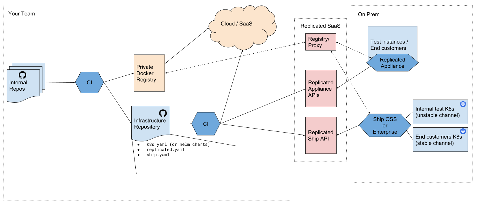

Replicated Ship Starter
==================
Starter project for managing a [Ship](https://ship.replicated.com) application in a GitHub repo.

### Prequisites

- `make`
- `node`
- `ship` installed. On macOS, you can use `brew install ship` to install with Homebrew
- A GitHub repository created to store your Ship application assets.

**Note:** While Ship supports any git repository, this example leverages features that are GitHub-only (for now). The repo you create can be private or public.

### Project overview

This project contains an example application that can be deployed with ship. The main pieces are

- `base` -- Kubernetes YAML that defines the application
- `scripts` -- Shell scripts to be distributed with the application, primarily for testing and troubleshooting the application
- `ship.yaml` -- ties these pieces together into a deployable application
- `Makefile` -- Workflows for testing the application installation experience
- [CI integration](#integrate-with-ci) starters for testing changes to your application.

### Get started

First, clone the repo and re-initialize it

```
export MY_APP_NAME=my-cool-app

git clone https://github.com/replicatedhq/replicated-starter-ship.git ${MY_APP_NAME}
cd ${MY_APP_NAME}
rm -rf .git
git init
git remote add origin <your git repo>
```

### Hello, World!

To get started, you'll want to update the following fields in `Makefile` and `ship.yaml`:

- `Makefile` `REPO` -- update this to the `<owner>/<repo>` of your repository on GitHub
- `ship.yaml` `assets.v1.*.github.repo` -- this should match the `REPO` value in `Makefile`

You can test this out by launching ship with

    make run-local

This will open a browser and walk you through configuring the application defined in `ship.yaml`. The test application creates a small Kubernetes Deployment to run Nginx, but it's a good way to get a sense of how ship works.

You can inspect the YAML at `tmp/rendered.yaml`, and deploy the app using kubectl by running

    make deploy-ship

or

    kubectl apply -f tmp/rendered.yaml


### Iterate on your App

From here, you can add messaging and configuration options in the [config](https://ship.replicated.com/reference/config/items/) and [lifecycle](https://ship.replicated.com/reference/lifecycle/overview/) sections of `ship.yaml`, and modify YAML in `base` to match your kubernetes YAML.

The above

    make run-local

task can be run again to see the new changes. To iterate without using the UI, you can use

    make run-local-headless

to regenerate assets. State will be stored in `tmp/.ship/state.json` between runs, and will persist any changes to config options or Kustomize patches. To deploy it after running, you can

    make run-local-headless deploy

### Create releases

To create a release of a [Replicated Embedded Kubernetes](https://help.replicated.com/guides/ship-with-kubernetes) or [Ship](https://help.replicated.com/guides/kubernetes-with-ship) app to vendor.replicated.com, you'll need to configure a few additional fields.

1. Export your `REPLICATED_APP` and `REPLICATED_API_TOKEN` as described in [the kubernetes starter project](https://github.com/replicatedhq/replicated-starter-kubernetes#configure-environment)
2. Collect the channel ID for your unstable Ship channel from vendor.replicated.com and set it in the Makefile under `SHIP_UNSTABLE_CHANNEL_ID`.

Then, you can create appliance releases with

```sh
make release-appliance
```

and create ship releases with

```
make release-ship
```


### Integrate with CI

The project includes CI configs for [Travis CI](https://travis-ci.org) and [CircleCI](https://circleci.com).

Both configs will lint your `ship.yaml` and `replicated.yaml` for syntax and logic errors. Once a PR is merged to master, a release will be promoted to the channels designated in your Makefile.

#### Note about appliance

While the Makefile includes a task for `release-appliance`, this is still very much a ship-focused starter project.

#### Example workflows

The optimal workflow for delivering the same Kubernetes manifests to both Ship and Appliance apps will depend greatly on how your team ships code. An example workflow is shown below.


**Note**: This example asumes you'll be updating your kubernetes manifests in this ship repo manually. Depending on your scale and your process, its possible that your team will instead keep this infrastructure repository up to date automatically. For example, if you have many service repos, you may have core CI jobs for each service push updates to Kubernetes Manifests and image tags in this infrastructure repo as part of your delivery process



### Tools reference

- [ship](https://github.com/replicatedhq/ship)
- [replicated-lint](https://github.com/replicatedhq/replicated-lint)

### License

MIT


## Troubleshooting

#### `make run-local` fails with `github asset returned no files`

1. Double check the `assets.v1.github` entries in your ship.yaml match the `--set-github-contents` flags in your `Makefile`.

2. Note that the `make run-local` and `make run-local-headless` tasks don't handle symlinks well. If you have symlinks in your repo, or you've symlinked the repo root, this can cause issues. To determine if this is the cause, you can temporarily replace symlinks with the content they point to.
